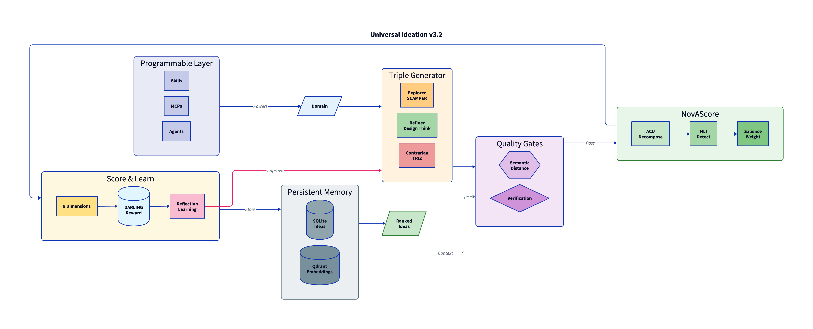

# Universal Ideation v3.2

Science-grounded autonomous ideation system with self-improving mechanisms.

## Features

- **Triple Generator** - Explorer, Refiner, Contrarian modes
- **8-Dimension Scoring** - Novelty, Feasibility, Market, Complexity, Scenario, Contrarian, Surprise, Cross-Domain
- **DARLING Learning** - Diversity-aware reward calculation
- **Atomic Novelty (NovAScore)** - 0.94 accuracy claim-level novelty detection
- **Verification Gates** - Quality checkpoints
- **Reflection Learning** - Self-improving pattern extraction
- **Plateau Escape** - Avoid local optima

## Architecture



## Installation

### As Claude Code Skill

1. Copy folder to `~/.claude/skills/universal-ideation-v3/`
2. Install dependencies:
   ```bash
   pip install -r requirements.txt
   ```
3. Invoke with:
   ```bash
   /universal-ideation-v3 "your domain"
   ```

### Optional: Vector Search

For semantic similarity features:
```bash
pip install qdrant-client sentence-transformers
docker run -p 6333:6333 qdrant/qdrant
```

## Quick Start

### Via Skill Command
```bash
/universal-ideation-v3 "e-commerce innovation"
/universal-ideation-v3 "sustainable opportunity in Malaysia"
/universal-ideation-v3 "ai start up innovation"
/universal-ideation-v3 "sustainable packaging innovation"
```

### Via CLI (Stub Mode)
```bash
cd ~/.claude/skills/universal-ideation-v3
python3 scripts/run_v3.py "your domain" --verbose
```

### Via LLM Runner (Full Mode with Claude API)

Requires Anthropic API key in `~/.env`:
```bash
CLAUDE_API_KEY=sk-ant-xxxxx
```

Run with full LLM integration + storage:
```bash
cd ~/.claude/skills/universal-ideation-v3
python3 scripts/llm_runner.py "your domain" -i 30 -m 30 -v
```

This mode:
- Uses Claude API for idea generation and scoring
- Stores ideas in SQLite database
- Stores embeddings in Qdrant for semantic search
- Exports full v3.2 statistics (DARLING learnings, atomic novelty, etc.)

## Options

### llm_runner.py (Full Mode)

| Flag | Default | Description |
|------|---------|-------------|
| `-i, --iterations` | 15 | Max iterations |
| `-m, --minutes` | 15 | Max duration |
| `-t, --threshold` | 60.0 | Acceptance score |
| `-v, --verbose` | false | Show progress |

### run_v3.py (Stub Mode)

| Flag | Default | Description |
|------|---------|-------------|
| `-i, --iterations` | 30 | Max iterations |
| `-m, --minutes` | 30 | Max duration |
| `-t, --threshold` | 65.0 | Acceptance score |
| `-v, --verbose` | false | Show progress |
| `--test` | false | Stub mode for testing |

## Storage

### SQLite Database
- Location: `data/ideation.db`
- Tables: ideas, sessions, learnings
- Persists all accepted ideas with scores

### Qdrant Vector Database (Optional)
- Location: `localhost:6333`
- Collection: `universal_ideas` (384-dim embeddings)
- Enables semantic similarity search

Start Qdrant:
```bash
docker run -d -p 6333:6333 qdrant/qdrant
```

## Output

Results saved to:
- `output/ideation_YYYYMMDD_HHMMSS.json` - Full session export
- `data/ideation.db` - SQLite persistence
- Qdrant vectors - Semantic embeddings (if enabled)

## Backup

Backup your ideas database:

```bash
cd ~/.claude/skills/universal-ideation-v3

# Create backup
python3 scripts/backup.py backup

# Create named backup
python3 scripts/backup.py backup -n "my_backup"

# View statistics
python3 scripts/backup.py stats

# List all backups
python3 scripts/backup.py list

# Export all ideas to JSON
python3 scripts/backup.py export -o my_ideas.json

# Restore from backup
python3 scripts/backup.py restore backup_file.db
```

Backups saved to `backups/` folder (both .db and .json formats).

## Testing

```bash
python -m pytest tests/ -v
```

## Structure

```
universal-ideation-v3/
├── SKILL.md              # Skill definition
├── README.md             # This file
├── requirements.txt      # Dependencies
├── scripts/
│   ├── run_v3.py        # Main orchestrator (stub mode)
│   ├── llm_runner.py    # LLM-integrated runner (full mode)
│   ├── backup.py        # Database backup tool
│   ├── generators/      # Triple Generator
│   ├── gates/           # Quality gates
│   ├── evaluators/      # Cognitive diversity
│   ├── learning/        # DARLING + reflection
│   ├── escape/          # Plateau escape
│   ├── novelty/         # Atomic novelty
│   └── storage/         # Persistence (SQLite + Qdrant)
├── tests/               # 74 unit tests
├── data/                # Runtime SQLite
├── backups/             # Database backups
└── output/              # Generated results
```

## License

MIT

## Version

v3.2 (2025-12-29)
